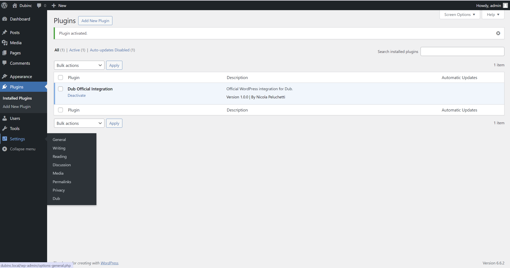
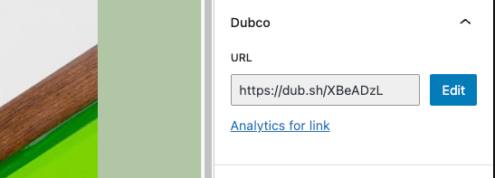

# Dub Wordpress Plugin

Official WordPress integration for Dub. Official WordPress integration for Dub. Shorten and manage your links directly in WordPress.

## Description

This is the official WordPress plugin for Dub. You can use the plugin to shorten and manage your links directly in WordPress. Plugin supports both Post Types and Custom Post Types. You can also track conversion events from link click to account signups.

Here are the main features of the plugin:

- Automatically create short links when a new post is published
- Update short links for keys for existing posts
- Track [conversion events](https://dub.co/help/article/dub-conversions) from link click to account signups

## Installation

1. Download the [latest version](https://github.com/dubinc/wordpress/tags) of the plugin.

2. Go to your WordPress admin panel and click on the `Plugins` menu.

3. Click on the `Add New Plugin` button and then click on the `Upload Plugin`.

4. Click on the `Choose File` button and select the plugin zip file you downloaded.

5. Install the plugin by clicking on the `Install Now` button.

6. Once the plugin is installed, click on the `Activate Plugin` button to activate it.

7. You will see a new menu item called `Dub` in the WordPress Admin panel under the `Settings` menu.

8. Create an [API key](https://dub.co/docs/api-reference/tokens) in your Dub account and paste it in the `API Key` field and click on the `Save Changes` button.

9. Choose the Post Types that will be integrated with Dub. When a post type is selected, you will be able to create short links for old posts of that post type, while for new posts shortlinks will be automatically created. Click `Save Changes` to save your settings.

## Usage

You will now be able to see the Dub meta box on the right side of the post editor. Here you can see the button to create a short link for existing posts.

Once a short link is created, you can edit the slug of the short link by clicking on the `Edit` button. The `Analytics for link` link will take you to the Analytics page on Dub.

Once you click on the `Edit` button you will be able to edit only the slug of the shortlink.
