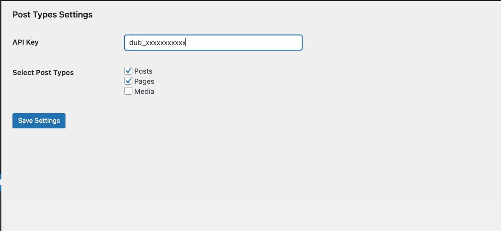

## Dub Wordpress Plugin

Contributors:
Tags: tag1, tag2
Requires at least: 4.7
Tested up to: 6.6.2
Stable tag: 1.0.0
Requires PHP: 7.4
License: AGPLv3
License URI: https://www.gnu.org/licenses/agpl-3.0.en.html

Official WordPress integration for [Dub](https://dub.co). Create and manage your short links and track conversion events – directly inside Wordpress.

## Description

This is the official WordPress Integration for [Dub](https://dub.co). It uses [Dub's API](https://dub.co/api) to programmatically shorten links inside Wordpress.

Features:
- Automatically create short links when a new post is published
- Edit short link slugs directly inside WordPress
- Track [conversion events](https://dub.co/help/article/dub-conversions) from link click to account signups

About Dub:
- [Terms of Service](https://dub.co/legal/terms)
- [Privacy Policy](https://dub.co/legal/privacy)

## Frequently Asked Questions

1. How can I install the WordPress plugin?

   To install the WordPress plugin for Dub, follow these steps:
    - Download the plugin from the [Official Github Repo](https://github.com/dubinc/wordpress/archive/refs/heads/main.zip)
    - Follow the steps detailed in the [Installation](#installation) section below

2. Is the plugin free to use?

   We have a generous [free plan](https://dub.co/pricing) at Dub that you can use to shorten and create up to 25 links a month. For higher limits, upgrade to our [Pro plan](https://dub.co/help/article/pro-plan).

## Installation
1. Once you have Downloaded the plugin, go to your WordPress admin panel and click on the `Plugins` menu.
2. Click on the `Add New` button.
3. Click on the `Upload Plugin` button which is located at the top near the Add Plugins header.
4. Click on the `Choose File` button and select the plugin zip file you downloaded.
5. Click on the `Install Now` button.
6. Once the plugin is installed, click on the `Activate Plugin` button.
7. You will see a new menu item called `Dub` in the WordPress admin panel under the `Settings` menu. Click on it to get started. 
8. Create an [API key](https://dub.co/docs/api-reference/tokens) in your Dub account and paste it in the `API Key` field. Click `Save Changes`
9. As you see in the image above, you will now be able to choose the Post Types that will be integrated with Dub. When a post type is selected, you will be able to create short links for old posts of that post type, while for new posts shortlinks will be automatically created. Click `Save Changes` to save your settings.
10. If you enter a onl Post, you will see a Dub meta box on the right side of the post editor. Here you can see the button to create a short link. 
11. Once a short link is created, you can edit the slug of the short link by clicking on the `Edit` button. The `Analytics for link` link will take you to the Analytics page on our website.  
12. Once you click on the `Edit` button you will be able to edit only the slug of the shortlink. Press `Update` to update it.  
12. If you create a new Post, the panel will show you a warning message, telling you that the short link will be created once the post is published. 

## Changelog
